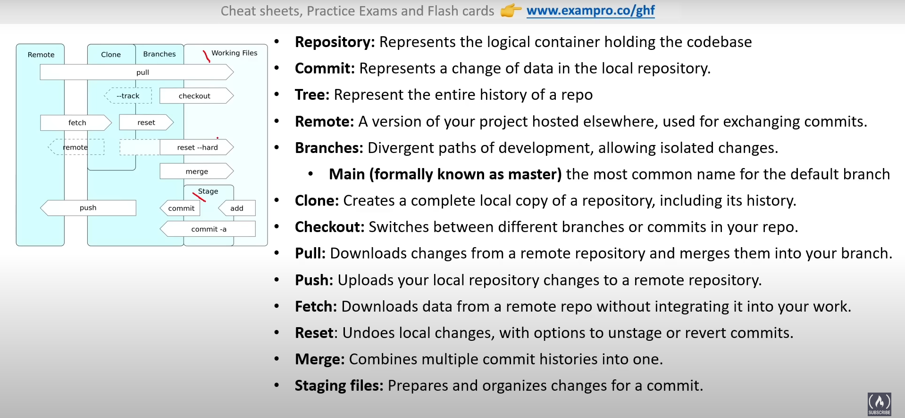
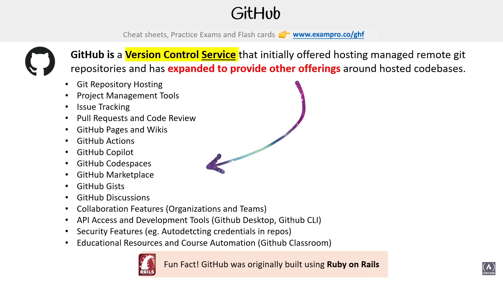

## Common Git Terms

## Version Control Services

## Introduction to Github

## Git and GitHub

## Github Repository

## Git Commit

## Git Branch

## Git Remote

## Upstream and Downstream

## GitHub Flow

## Github CLI

* In pallete , search devcontainer and  on that file add the feature
## SSH Keys

## Deploy Keys

## Github API

## Github.com vs Github Desktop

## Github Mobile

## Github Mobile Notification

## Types of Github Profile

## Git vs Git Pro

## Github Enterprise Development    

## Markdown

## Github Flavoured Markdown

## Upload Files

## GitHub User Profile Feature

## Basic Repo Navigation

## Create ta Repo

## Github Repo Template

## Cloning a Repo

## Adding File in Repo

## Creating a Branches

## Star a repo

## Watching Repos

## Git Tag

## Git Release

## Github Packages

## Github Insights

